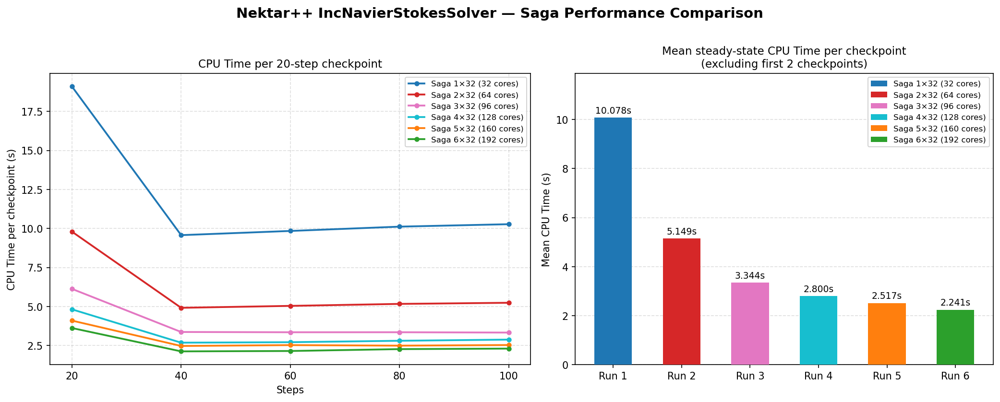

[](https://doi.org/10.5281/zenodo.18876167 )

# Nektar-container
Dockerfile (and Singularity Definition File) to build a Nektar++ container.

## How to get the container?

The corresponding image was automatically built on Quay.io from the `Dockerfile`.

One can pull the container image using either:

```
apptainer pull docker://quay.io/jeani/nektar:1.0.0
```

or

```
docker pull quay.io/jeani/nektar:1.0.0
```

## How to use it?

Start the container and type `source /opt/start.sh` to activate the conda environment.

If the `input` file and `.sif` are in the current working directory, the execution command will be something like:
```
export APPTAINER_BIND="${PWD}:/opt/uio"
NPZ=16
srun -n $SLURM_NTASKS --mpi=pmi2 singularity exec nektar_1.0.0.sif bash -c "source /opt/start.sh && cd /opt/uio && IncNavierStokesSolver --npz ${NPZ} base_flow.xml 2>&1 | tee mvapich_base_flow_${SLURM_JOB_NUM_NODES}nodes_${SLURM_NTASKS}ranks.log"
```

## Performances

The image below provides an example of runs with 1 to 6 nodes on the HPC Saga, with the `CPU Time per 20-step checkpoint`  (in s) and the `Mean steady-state CPU Time per checkpoint` (excluding first 2 checkpoints).



